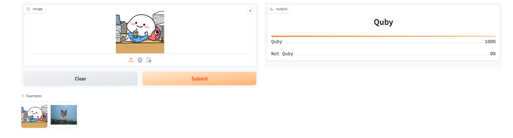

# Quby Classifier

This project is a machine learning model that classifies whether an image is a Quby or not. It uses a pre-trained model that is loaded and used for predictions.



## Getting Started

These instructions will get you a copy of the project up and running on your local machine for development and testing purposes.

### Prerequisites

-   Python 3.8 or higher
-   Docker (optional)

### Installing

1. Clone the repository:

    ```sh
    git clone https://github.com/cjzhi98/quby-classifier.git
    ```

2. Navigate to the project directory:

    ```sh
    cd quby-classifier
    ```

3. Install the required Python packages:
    ```sh
    pip install -r requirements.txt
    ```

## Running the Application

There are two ways to run the application:

1. **Python**: You can run the application directly using Python. Make sure you have installed all the necessary packages listed in the `requirements.txt` file. To start the application, use the following command:

    ```sh
    python app.py
    ```

    The application will be accessible at http://localhost:8080.

2. **Docker**: Alternatively, you can run the application using Docker Compose. This requires Docker to be installed on your machine. To start the application, use the following command:

    ```sh
    docker run -it --rm -p 127.0.0.1:8000:8000 cjzhi98/quby-classifier
    ```

    The application will be accessible at http://localhost:8000.

## License

This project is licensed under the MIT License. The MIT License is a permissive free software license originating at the Massachusetts Institute of Technology (MIT). It puts only very limited restriction on reuse and has, therefore, high license compatibility.

For the full license text, please see the [LICENSE.md](LICENSE.md) file in this repository.

## Built With

-   [Gradio](https://pypi.org/project/gradio/)
-   [FastAI](https://pypi.org/project/fastai/)
